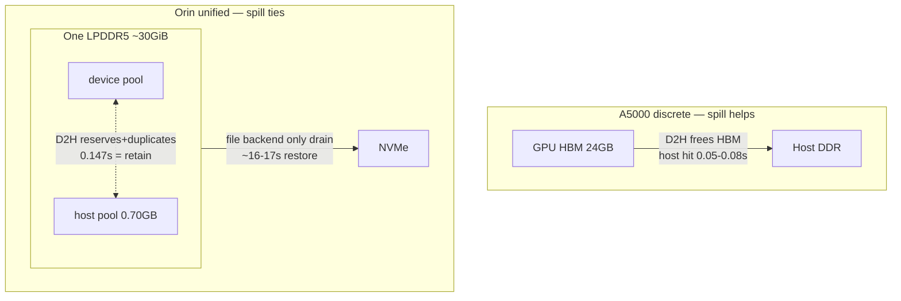

# TierKV SRS Learning Guide — from LLM/KV basics to our exact claim and method

Who: anyone who knows how an LLM decodes and what a KV cache is. Goal: understand our HiPC SRS 2026 2-pager end-to-end — problem, method, numbers, what they prove, what they don't.
Status: sealed through `8a813b3`. No mock numbers — every number below traces to `results/*.json` + `runs/imported/*/SHA256SUMS`. Original `HiPC/proposals/02_*` is SUPERSEDED, never cite.

## 1. Problem in one paragraph

Datacenter LLM servers spill idle KV cache GPU→CPU DRAM→disk to free HBM. Edge developers ported the same code to NVIDIA Jetson Orin, where CPU and GPU share one LPDDR5 pool. Copying "GPU→Host" there frees no physical DRAM — it reserves pool, duplicates during copy, and stalls decodes — while the file tier is the only drain. We prove this contrast with the same SGLang HiCache op on Orin-32GB unified vs 2x RTX A5000 discrete, plus replicated file-tier cost, as a bounded measurement study (not a new pager).

## 2. Background you need

### 2.1 Autoregressive decode + KV cache (30s refresher)
Prefill processes the prompt once, then each output token attends to all prior keys/values. Without caching this is O(n²); with KV cache each step reads cached K/V and appends one row. Our workload: fixed prefixes L=2048/4096/6011 tokens, greedy `temp0 ignore_eos`, foreground 64-out + background 4x128-out. Verify `completion_tokens==64/128` — counts are the ground truth, not SSE chunks.

Observed sizing (not theory): MiniCPM5-2B BF16 ctx8192, KV 8192tok≈1.26GB per smoke (`config/tracker.json`). Matrix L6011 reloads serve `cached 6010 = dev 6010` on retain; h2d serves `6 + 6004` host after filler eviction.

### 2.2 SGLang HiCache tiers (what we actually toggle)
- L1 device radix pool (GPU pages). L2 host pool per-instance (`--hicache-ratio 2.0` → 0.70GB logged, 16385 tok). L3 file backend (`--hicache-storage-backend file`, `HiCacheFile`, demo-grade) at `SGLANG_HICACHE_FILE_BACKEND_STORAGE_DIR` on NVMe.
- `--hicache-io-backend {kernel: GPU-assisted, recommended | direct: cudaMemcpyAsync}`. `--hicache-mem-layout page_first_direct` with direct. Kernel H2D is systematically fatal on Orin (3/3 crashes, illegal-access class) — we run H2D ONLY with direct (`config/tracker.json:19` FROZEN).
- `cached_tokens_details {device, host, storage}` tells which tier served. `device 6010` = device-hit resume ~0.15s. `host 6004` = host restore ~14.7s. `storage 1408-5992` = file restore ~16s. `cached 0/1` = cold full prefill ~1.33s.

### 2.3 Tegra unified vs discrete physical truth
Orin AGX 32GB: ~30GiB usable (`MemTotal 31433640 kB`), one LPDDR5 package, MAXN, L4T R36.4.4 CUDA 12.6. `cudaMemGetInfo` reports virtual allocator bounds — NEVER physical. Physical = `/proc/meminfo MemAvailable` sampled 10-50ms around copy + peak dip. A5000: 2x24GB HBM discrete, driver 560.28.03 CUDA 12.6, 251Gi host RAM — D2H genuinely frees HBM (nvidia-smi used/free moves).

EMC: `mc_all` is a 20ms-window decaying avg-activity counter, `clk_rate` sits at 204MHz DVFS floor. Report raw `mc_all` timeline + `bg_gap_max` (worst background stall). Never present `d(mc_all)/dt` as GB/s. Energy: integrate `VDD_GPU_SOC+VDD_CPU_CV+VIN_SYS_5V0` V·I over `t0..t1` → `joules_window_j`. 500ms samples cannot do per-token energy.

## 3. Related work — precise deltas (cite these, not ignore)

| Work | Owns | Our delta |
|---|---|---|
| NVIDIA CUDA for Tegra AppNote | zero-copy/pinned/unified share DRAM, coherence costs | we quantify SGLang allocator effect (pool reservation + guard) via MemAvailable, docs never do |
| SGLang HiCache docs + `hicache_storage.py` | L1/L2/L3, direct/kernel, page_first, write policies, file=demo | we test discrete-assumed benefit on unified, document kernel-crash + direct workaround + file byte-exact spill vs slow restore |
| PagedAttention/vLLM swap vs recompute | paged swap bounded by GPU blocks else recompute | we instantiate on Tegra+SGLang paired blocks: recompute-linear 0.218ms/tok vs resume-flat |
| LMCache/InfiniGen/DeepSpeed | datacenter tiering over PCIe, infinite host DRAM | assume separation; break on unified duplication/guard |
| Arya-Simmhan PAISE25 / Pagoda ICPP26 | Orin offline throughput + CNN/BERT rooflines | we do serving KV lifecycles + bus interference + storage tiers |
| SRS 048/054/059 | streaming IPC, Wasm 10-run avg, T4 throttle 1.63x | floor: one bottleneck + 1-2 comparative plots suffices; we exceed with CIs + power + stronger baselines |

## 4. Why this matters + prof's ask

Prof rejected early ideas, asked for Orin shared vs A5000 workstation comparison. This delivers exactly that as a controlled op-level contrast, plus the file-tier cost the edge runtime actually pays. SRS accepts measurement/headroom studies (048/054/059/087-shaped) — narrow + honest beats broad + leaky for 2 pages.

## 5. Expected results (hypotheses)

- H1: host D2H frees HBM/fast on A5000, ties retain on Orin (device-hit, MemAvailable not freed).
- H2: H2D restore slow everywhere, far slower on Orin (blocking + server-wide bg penalty).
- H3: file restore works but costs ~10-100x device-hit, stable across blocks.
- H4: natural-text ShareGPT reproduces synthetic ordering (sensitivity, never main).

## 6. Approach — 4 arms, matched work, paired blocks

Locked (`AGENTS.md`): `RETAIN / HOST_D2H_H2D / RECOMPUTE_FLUSH_PREFILL / NVME_DIRECT_SPILL`. Independent single-turn requests only. Same tokenizer IDs, same 64/128 budgets/policy, same chunk2048/radix-lru/graphs/flashinfer, common KV pool. Boards reported separately, never pooled; cross via ratio-of-ratios with independent resampling.

Gating (enforced in `analysis_main.py:129-146`): `matrix_pass + arrival_ok (http200 + comp==64)`, warmups `warm=True` never pooled, failures/crashes indexed never pooled. Stats: blocks are reps (n=5), paired-block 95% bootstrap B=10000 seed20260921 (+crc32 per-contrast), 10% practical margin (`practically_equivalent` vs `clears_margin_*` vs `underpowered_wide_ci`).

## 7. Methodology — how to read any cell

Per-cell JSON has `t0/t1` window, `mem[]` (MemAvailable kB), `emc[]` (mc_all + emc_hz), `rails_temps[]`, `background[]` (tpot_s, gap_max/p95), `arrival` (ttft_s, cached split, prompt/comp). Metrics:
- `resume_TTFT_s` = arrival.ttft_s on reload (hit). `cold_TTFT_s` = recompute flush+prefill.
- `mem_dip_MB` = lead-mean minus load-min (transient); `mem_baseline_MB` = lead-mean (allocator reservation story).
- `bg_gap_max` = primary interference (arrival stall); `bg_tpot_mean` secondary.
- `cached dev/host/storage` = which tier served (see §2.2).
- `joules_window_j` = integrated rails over window.

Seals: `find -not -name SHA256SUMS sha256sum` sorted + `sha256sum -c`, per-dir PASS, 0 mismatch before import. Analysis reads `runs/imported/*` only, writes `results/*` only.

## 8. Experiments carried (all sealed)

- matrix-v1 Orin 60/60 meas PASS (nvme 0/15 crash-indexed illegal/Scheduler, 0 OOM): 3Lx5armsx5blocks + h2d spill/fill sub-phases, 4xbg128 overlap 500ms.
- campaign-v2 Strand A NVMe-direct 15/15: same 3Lx5, direct+file flags, fresh server/block. All meas device-hit (pool absorbs KV).
- Strand B file-overflow 10/10: flush→spill C/D/E 64-out (5994/6285/6896tok) overflow 0.70GB → reload C 64-out quiet + loaded 4xbg128, `-v` bind persists 863MB/blk 20012 files.
- ShareGPT b0-b4 n=5 (nvme skipped): 6011-tok slice `192ab218` SHA `f8c96b`, victim natural text + synthetic bg (recorded asymmetry). h2d b0 crash indexed.
- A5000 pilot 16/16 + main 80/80 PASS: 2Lx2Bx4armsx5, GPU1 CVD, LD fix for cu13 loader, role-unique leadings, first-token alive callback, dual-GPU smi. 0.5.20 cu126 vs Orin 0.5.16 confound recorded.

Plots/CSVs: `results/figures/mem-bars.csv`, `ttft-crossover.csv`, `tpot-concurrency.csv`, `emc-timeline-sample.csv`, `joules-windows.csv`, `campaign-v2-ttft.csv`.

## 9. Results — sealed numbers + what they signify

Orin L6011 (n=5): retain 0.148s [0.145,0.149] dev6010 = host_d2h 0.147s (diff −0.001 practically_equivalent) — H1 unified tie. Recompute 1.332s (+1.18 clears). H2d-direct 14.68s [14.25,14.96] (+13.35 over recompute clears), bg_tpot 0.145 vs 0.031 (+0.115 clears), gap_max 13.8-14.9s vs 0.087s — H2D buys ~nothing over its own 14.7s miss. Baselines: retain ~18323MB vs host_d2h ~17646MB (~680MB reservation, not transient).

A5000 (n=5): host/retain 0.351 [0.334,0.374] L2048 / 0.167 [0.164,0.169] L6011 — host fast (0.053 vs 0.152s, 0.081 vs 0.482s). H2d/retain 5.9/5.35x (+2.10s L6011), bg 2.1x TPOT / 6.3x gap_max server-wide. Recompute≈retain (eviction validated). H1 discrete help confirmed.

Cross RoR Orin/A5000 TTFT: host/retain 2.79 / 5.93, h2d/retain 7.12 / 18.58 (`results/cross-summary.json`, independent resampling, version confound in every table).

File-tier: quiet 17.00s [16.58,17.54] ~3.8k cached (6+2042+1793) vs loaded 15.77s [15.35,16.33] 5993 cached (1+0+5992), paired quiet−loaded +1.23s [1.15,1.30]. Vs Strand A device-hit 0.12-0.15s ≈108-145x (~130x signature), 25/25 gated. H3 proven stable.

ShareGPT n=5: retain 0.145s / host_d2h 0.150s / recompute 1.335s / h2d 14.29s (n=4, b0 crash listed) — same ordering as synthetic. H4 sensitivity holds.

Signify: same HiCache op is a speedup on discrete, a tie + reservation + blocking restore on unified; file is the only drain and costs ~130x device-hit; direct backend mandatory (kernel fatal).

## 10. Contribution analysis — narrow claim that survives

> Same SGLang HiCache host/file offload that frees HBM and serves 3-6x faster than retain on A5000 ties device-hit on Orin-32GB unified (no MemAvailable free), requires direct backend (kernel H2D fatal), and restores from file in ~16-17s vs ~0.13s device-hit (~130x, 10/10 replicated).

SRS fit: exceeds 048/054/059 floor (paired CIs + power + eviction-validated + stronger baselines + accuracy-by-counts + setup accounting). Limits stated: 0.5.20 vs 0.5.16 confound (no arch-only claims), n=5 wide-by-construction underpowered memdips, EMC utilization-only, ShareGPT sensitivity-only, bg asymmetry, 2-6K range (8192 proposed, 16K open).

## 11. Future + remaining work

- Device: 0.5.16 A5000 control (needs R570+/sudo) to isolate arch vs version; 8192/16K extension if admission passes; Granite realism (host cannot boot — guard study).
- Paper: `paper/outline.md` → `main.tex` 2pp + tier fig + MemAvailability/gap_max fig + TTFT table, 4-5 refs, AI disclosure, student `*` + advisor letter (human-only), Linklings submit + `SUBMIT.md` receipt. Deadline Sept 24 AoE (extension unconfirmed).
- Tracker: freeze `config/tracker.json` drift (64/128, L6011, mfs0.50, mrr6) with human approval; never mix pre/post.

## Appendix — file map + how to verify in 5 minutes

- `config/tracker.json` choices, `campaign-v1.json` frozen matrix, `campaign-v2.proposal.json` strands.
- `src/tierkv/analysis_{cells,main,stats,sharegpt,sharegpt_expand,campaignv2}.py`, `plot_figures.py`, `tests/test_tracker.py`.
- `results/summary.json` (matrix), `campaign-v2-summary.json`, `sharegpt-expand-summary.json`, `cross-summary.json`, `coverage.json`, `figures/*.csv/*.pdf`.
- `runs/imported/{matrix-v1,phase1,extras,crash-probe,sharegpt,campaign-v2/{nvme-direct,file-overflow,sharegpt-expand},a5000-main}/SHA256SUMS`.
- Verify: `sha256sum -c` per dir, `PYTHONPATH=src python3 -B -c "import tierkv"`, re-run analyses md5-identical (only new files change).
